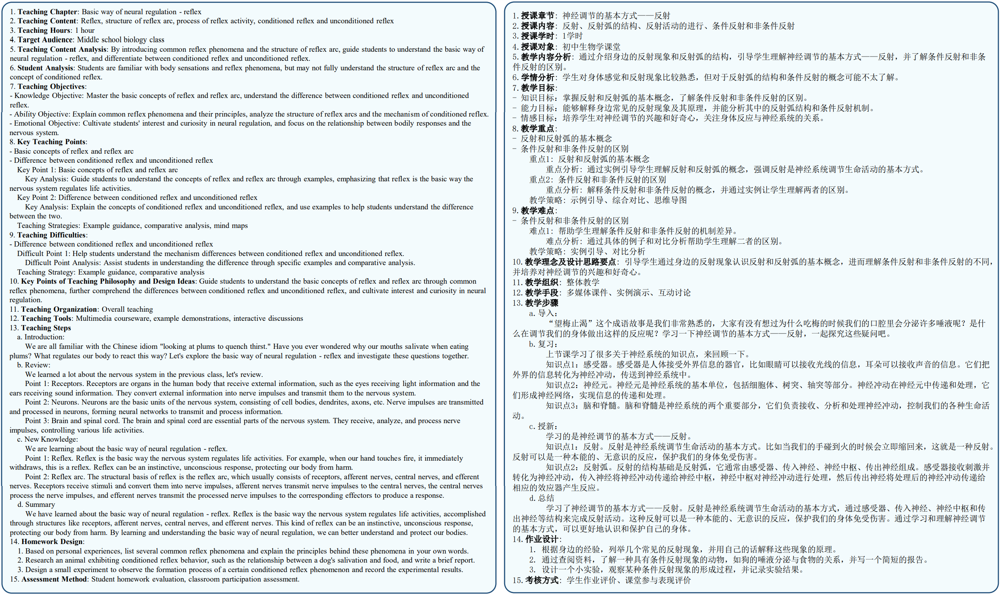
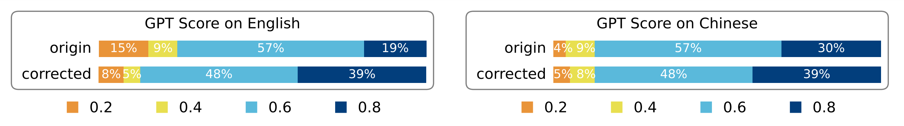

# LANG: A Lesson Plan Generation Framework via Multi-Form Interaction with Large Language Models

## Dataset

### Statistics

#### Distribution

Distribution chart of lesson plans across different educational stages and subjects:

<div style="text-align: center;">
  
</div>

#### Length

Average word count of lesson plans in English and Chinese:

<div style="display: flex; flex-direction: column; align-items: center">
  
  
</div>

</div>

### Lesson Plan Showcase

<div style="text-align: center;">
  
</div>

### Access

Our dataset samples are available in the [dataset](dataset) directory. The samples are in JSON format and can be accessed as follows:

```python
import json
samples = json.load(open('dataset/en-samples-10.json', encoding='utf-8'))
```

### Dataset Details

Each data entry includes `id`, `language`, `query`, `input` and `output`. The `query` refers to the teacher's inquiry (knowledge point), the `input` is the prompt provided to the LLMs, and the `output` is a complete lesson plan.

```json
{
    "id": "01",
    "language": "en",
    "query": "...",
    "input": "...",
    "output": "..."
}
```

## Comparing

Comparison of chapter correction before and after based on GPT Score:

<div style="text-align: center;">
  
</div>

Teacher satisfaction:

<div style="text-align: center;">
  
  
</div>
